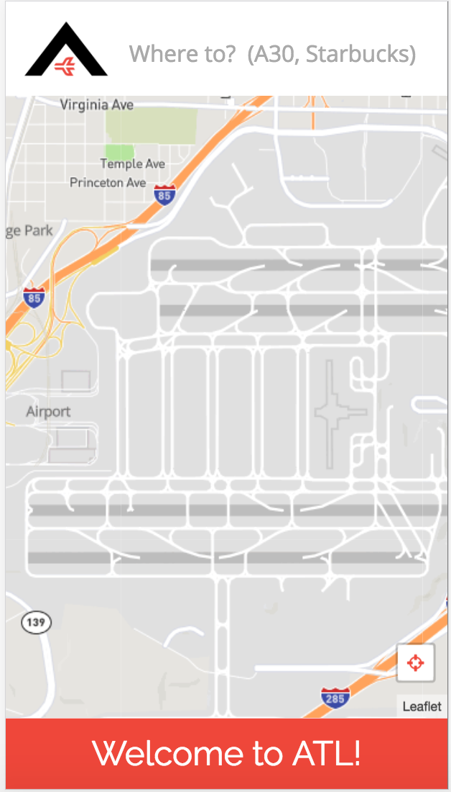
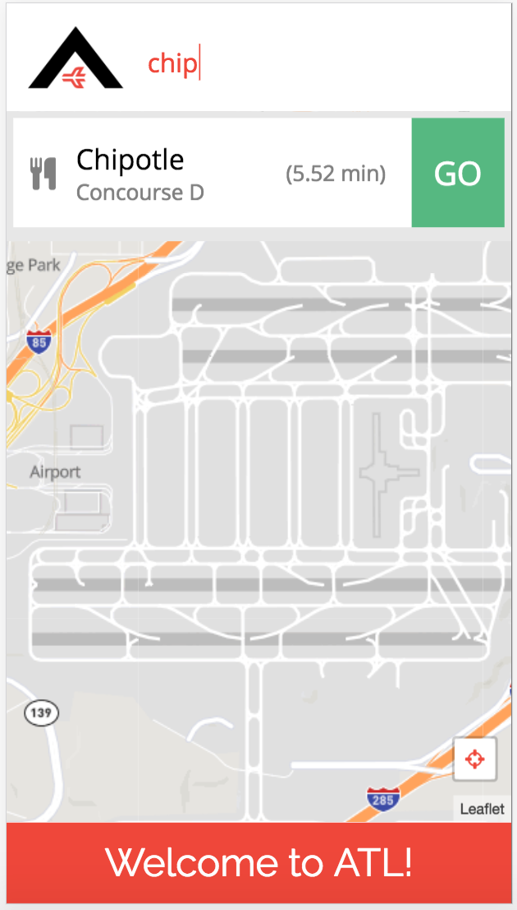
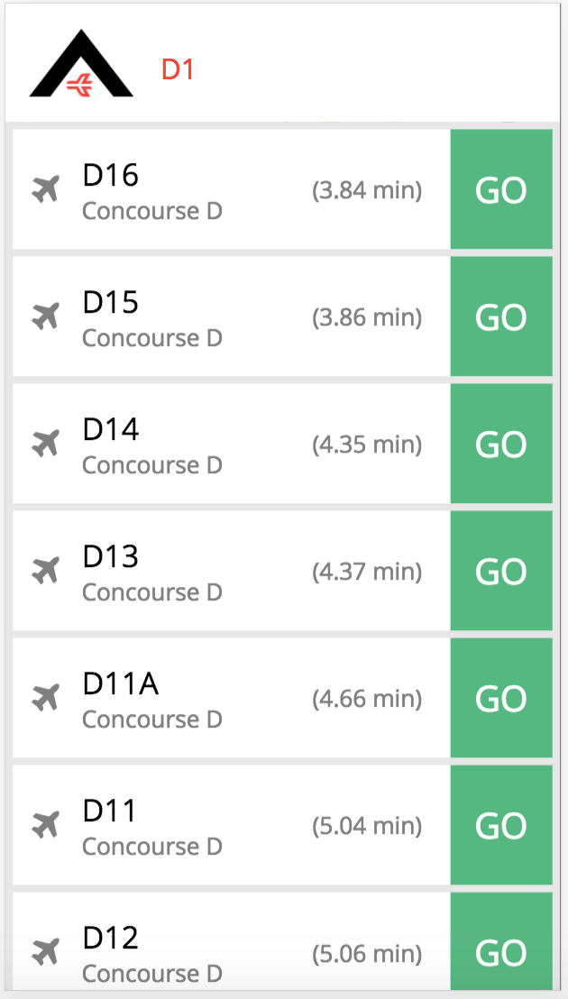
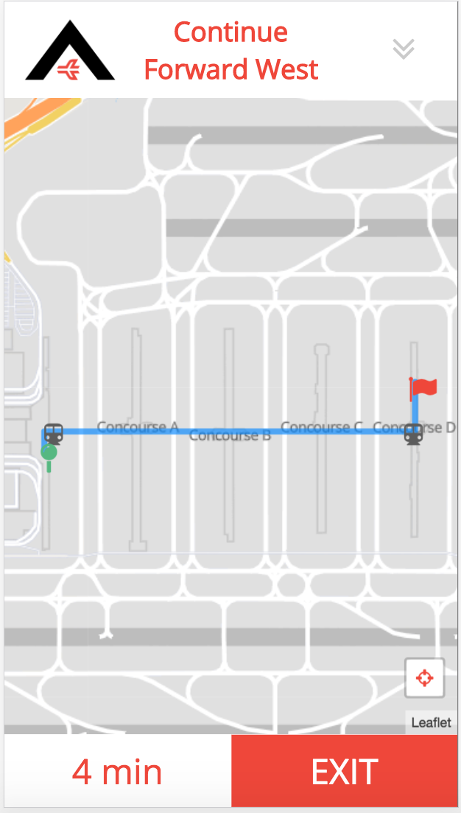
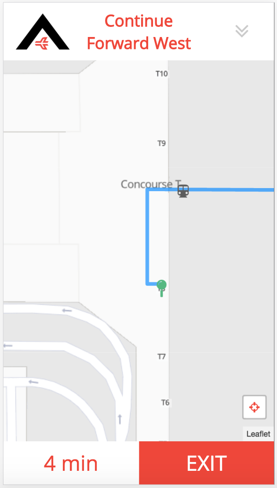
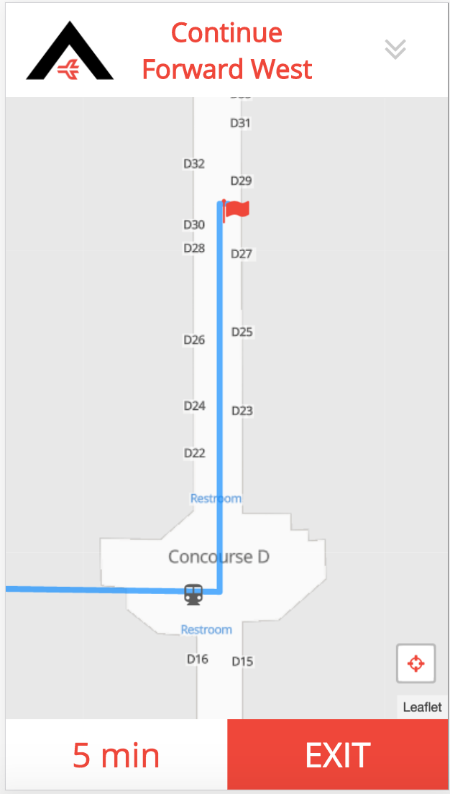
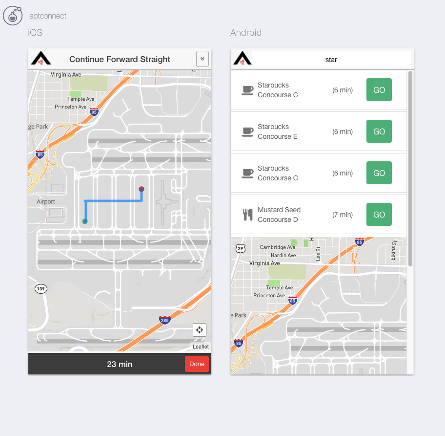

# The "A" Team - AirNav

######
[Live Project](https://airnavatl.com/#/home)   |  [Overview](https://github.com/DigitalCrafts-September-2016-Cohort/the_a_team2#overview)   |   [Team](https://github.com/DigitalCrafts-September-2016-Cohort/the_a_team2#team-members--roles)   |   [What We Used](https://github.com/DigitalCrafts-September-2016-Cohort/the_a_team2#what-we-used)   |   [MVP](https://github.com/DigitalCrafts-September-2016-Cohort/the_a_team2#mvp-minimum-viable-product)   |   [Challenges](https://github.com/DigitalCrafts-September-2016-Cohort/the_a_team2#challenges--solutions)   |   [Code](https://github.com/DigitalCrafts-September-2016-Cohort/the_a_team2#code-snippets)   | [Screenshots](https://github.com/DigitalCrafts-September-2016-Cohort/the_a_team2#airnav-screenshots)   |
[Airport Terminal Maps](https://github.com/DigitalCrafts-September-2016-Cohort/the_a_team2#airport-terminal-maps)   |   [Contributing](https://github.com/DigitalCrafts-September-2016-Cohort/the_a_team2#contribute-to-airnav)


## Overview:
Atlanta Airport Navigation (AirNav) is a web application designed to help Atlanta
Airport travelers navigate the world's busiest airport. Hartsfield-Jackson Atlanta
International Airport, known locally as Atlanta Airport, is located 7 miles south
of the central business district of Atlanta. The Atlanta Airport has 5 runways,
7 concourses and 209 domestic and international gates, so AirNav was built to
help the millions of travelers that come through the Atlanta Airport to easily
navigate their way from terminal to terminal, find restaurants or shopping along
the way, as well as locate their baggage and ground transportation.


**Concept:**
* Turn-by-turn directions, each step updated in map view as well as full list view
* Use automated geolocation to get user location and origins
* List of all points of interest along route to gate destination
* Deploy as a web app AND a mobile app for both iPhone and Android using the Ionic framework

##Github Link:
[AirNav](https://github.com/DigitalCrafts-September-2016-Cohort/the_a_team2.git)

##Team Members & Roles:
**Click on each member's name to see their GitHub profile**
All team members are students in the [Digital Crafts](https://digitalcrafts.com) September 2016 cohort. This project was initially completed as the second project for that curriculum and utilized the SCRUM agile development methodology.  Paired and mob programming were the focus in the initial and final stages, while mid- and late-stage work was primarily completed through individual but coordinated and co-located programming.

####The A Team
* [Jesslyn Landgren](https://github.com/jesslynlandgren/)  
**Primary team role:** Front-end Gladiator/Back-end backup, styling<br />
**Contributions:**  Provided initial project concept. Built a custom layout from scratch with focus on flat design. Split initial algorithm and logic for creating basic custom network graph with Keyur, then assisted with troubleshooting the implementation throughout the project.  Led team in planning the functionality, user-interface, and evaluating it through the project.<br />
**Key code portions:** Most of the HTML, CSS and JavaScript.

* [Keyur Patel](https://github.com/ekeyur/)  
**Primary team role:** Back-end Soldier<br />
**Contributions:** Created the api's needed from python backend for shortest path between two nodes. Modified the original algorithm to accomodate the adding of vertices and return of the route. Built a custom, responsive layout from scratch with focus on clean, robust design. Implemented functionality via the back end, utilizing Djikstra's algorithm, returning data from the JSON file for use in front end functionality. <br />
**Key code portions:** Most of the Python code (server.py) and data (points.JSON).

* [Jason Campbell](https://github.com/mtnzorro/)  
**Primary team role:** Ionic Trooper, AngularJS, Front End functionality, Front end styling, Deployment<br />
**Contributions:** Developed the Ionic version of the app in conjuction with the main site build.  Additionally, helped to build the functionality of front end of the web app, utilizing AngularJS, along with initial decisions of the front end structure.  Handled deployment of the web app to AWS. [Ionic repository on GitHub](https://github.com/DigitalCrafts-September-2016-Cohort/airport_connect_ionic)<br />
**Key code portions:** All of the Ionic build.  Front end AngularJs contributions to the main JS file.

* [Trista McCleary](https://github.com/mccleary/)  
**Primary team role:** UI/UX chief, prototype, styling<br />
**Contributions:** Scrum master. Led daily stand up meetings and maintained virtual scrum board. App name, app logo. Assisted with all things visual/client-facing. Regularly studied all code throughout project.<br />
**Key code portions:** UI/UX mock-ups, shell HTML, README file

##What we used:
**Languages:**
* Python
* JavaScript
* HTML5
* CSS

**Frameworks:**
* AngularJS
* Flask
* Ionic

**API's**
* Mapbox
  * Custom Map Style built from Mapbox-Streets-v7
* Leaflet (Leaflet Angular Directive)
  * [Leaflet Locate Control Plugin](https://github.com/domoritz/leaflet-locatecontrol)

**Other:**  
* Font Awesome
* Sketch
* InVision
* [Open Street Map](http://www.openstreetmap.org/)
* [simpleWeather.js](http://simpleweatherjs.com/)


##MVP (Minimum Viable Product):

* Point-to-point navigation
* Search for destination
* As-You-Type search suggestions for all points of interest
* Returned route is shortest path
* Display gate-to-gate route on a map
* Turn-by-turn directions, list view
* Update and display the remaining time until reaching the destination
* Auto-detect user location and follow along with the navigation route
* Points of Interest along the route (restaurants, shopping, coffee, restrooms)

We planned our stretch goals in advance of reaching MVP and portions of the team began work on them about 2 days before the project deadline.

**Stretch Goals**
* Search box with drop-down for sub-categories(food, shop, baggage)
* Style map points
* App functionality in Ionic
* Field testing of geolocation features

## Challenges & Solutions:
**Some of the biggest challenges we faced with this project build included:**

1.  **Challenge:** Ionic Implementation

    **Solution:**  Knowing that the webapp would only make sense in mobile form, we wanted to make a strong push to build a native option for iPhone/Android, and Ionic was a logical choice, being that it utilizes Angular for development.  Jason spent the weekend before the project researching and learning Ionic, and the team determined early on that pushing for the Ionic build would be worth the added time and effort.  Through trial and error, and help of a Digital Crafts alum, we were able to build an Ionic version of the webapp alongside the main build.
[Ionic repository on GitHub](https://github.com/DigitalCrafts-September-2016-Cohort/airport_connect_ionic)

2.  **Challenge:** Understanding Dijkstra's algorithm such that we were able to   effectively implement it into the back end for purposes of calculating the shortest route between the origin and given destination.  

    **Solution:** Thorough study of the algorithm, through materials (articles, videos) and group meetings walking through concepts including the heap sort, the algorithm itself, along with sample code examples of others who'd successfully implemented the algorithm.  Coupled with a couple of hours worth of white boarding, and meticulous walk throughs, we were able to successfully implement the algorithm programatically.

3.  **Challenge:**  Implementing user-friendly dynamic search.  When a user types in a search query, we need to return a list of destinations that match their entered query, but also show and sort the returned results by the distance from the user's current location.  The method to search goes through all network node names and calculates a shortest path via Dijkstra's algorithm.  Our search is dynamic, so it is called (and results displayed) after every character is typed.  For very short search strings, a large number of results are returned and there is a significant lag in displaying them.  

    **Solution:** To counteract this we handle queries of different lengths differently. Initially we only performed a search if they query was greater than 3 characters, but because we don't have a functionality for multiple node aliases (the user has to type exactly the gate number), we need to support 2 character searches because all gate names are 2-3 characters. We solved this by only searching gates if the query is less than 3 characters and then searching all place nodes if the query is 3 characters or greater. To further accomodate this problem, we implemented MEMOIZATION: i.e. created a dictionary and appended all the routes searched stored the dictionary in a file. This allowed the path to be calculated only once and look it up in the dictionary the next time same route is searched.


##Code Snippets

<!-- Insert code here -->
We created a front-end service to access the API we built on the back-end.  We have two main methods, one for searching for a destination node, and one for retrieving the shortest path from origin and destination to be shown in the navigation view.  (The all points method was for debugging purposes)

```JavaScript
//App Service for accessing the API
app.factory('AirportConnect', function($http) {
    var service = {};
    //Searches for nodes based on a query
    service.getSearchResults = function(query, origin) {
        var url = '/search';
        return $http({
            method: 'GET',
            url: url,
            params: {
                query: query,
                origin_id: origin.id
            }
        });
    };
    //Returns route object (array of nodes and array of instructions) given origin and destination
    service.getRoute = function(origin, destination) {
        var url = '/shortest_path';
        return $http({
            method: 'GET',
            url: url,
            params: {
                origin: origin.id,
                destination: destination.id
            }
        });
    };
    //Gets all points in graph (ONLY USED FOR DEBUGGING)
    service.getAllPoints = function() {
        var url = '/all_points';
        return $http({
            method: 'GET',
            url: url,
        });
    };
    return service;
});
```

A large portion of the front-end work was converting our JSON data to GeoJSON, setting property specific styles, and displaying.  The more difficult parts came in the logic for updating the map view and navigation instructions based on a user location.  We start with itertable route points and instruction objects and check every time a location is returned by the .locate() method of our map

```JavaScript
//If user location found, check to see if user has reached the next point in the route
//Every 20 seconds
map.on('locationfound', function (e) {
    console.log(e.latlng, e.accuracy);
    $scope.step_by_step = $scope.instructions_check[0];
    $scope.time_left = parseInt($scope.dist_to_dest_check[0]/270);

    ///Takes array of route points and removes one each time the user reaches it
    var tolerance = 0.000137;
    if ($scope.point_route_check) {
        //If only one point remaining in route
        if ($scope.point_route_check.length === 1){
            //If user is close to remaining point in route, then they have arrived
            if (((e.latlng.lat - $scope.next_point.latitude) < tolerance) && ((e.latlng.lng - $scope.next_point.longitude) < tolerance)){
                //Sets page to arrived state
                $scope.arrived = true;
            }
        }
        //If there are remaining steps in route (>1)
        else if ($scope.point_route_check.length > 1){
            //Current point is first point in route points array
            $scope.current_point = $scope.point_route_check[0];
            $scope.next_point = $scope.point_route_check[1];
            //If user is close to the next point in the array
            if (((e.latlng.lat - $scope.next_point.latitude) < tolerance) && ((e.latlng.lng - $scope.next_point.longitude) < tolerance)){
                //Get instructions for current route point
                $scope.step_by_step = $scope.instructions_check[0];
                //Get distance remaining for current route point (convert to time)
                $scope.time_left = parseInt($scope.dist_to_dest_check[0]/270);
                //Remove current point, its instructions, and its dist from route arrays
                $scope.instructions_check.splice(0,1);
                $scope.point_route_check.splice(0,1);
                $scope.dist_to_dest_check.splice(0,1);
            }
        }
    } else {

    }
});
```
Code in python for generating vertical centerline path. for all the terminals.
```
# Code for creating vertical center points for path
json_len = len(pointsJSON)
point_id = 5000
for concourse in concourses:
    # // For each initial JSON point (from OpenStreetMap)
    for i in range (0, json_len):
        # // Only look at points (gates) in the current concourse
            # // Create new JSON point that connects JSON point (gate) to concourse centerline
        if pointsJSON[i]['concourse'] == concourse['name']:
            bool1 = pointsJSON[i]['name'][1:] in E_horizontal
            bool2 = pointsJSON[i]['name'] in E_horizontal
            if (not bool1 and not bool2):
                if (not pointsJSON[i]['poi_type'] == 'train'): # excluding the train terminal gates
                    gate = pointsJSON[i]
                    center = {}
                # // Longitude of new point is the centerline longitude of current concourse
                    center['longitude'] = concourse['longitude']
                # // Latitude of new point is the same as the gate that we are connecting to concourse centerline
                    center['latitude'] = gate['latitude']
                # // Name of new point is the same as the gate name but with a double letter for the concourse (ex: gate A1 connects to concourse centerline at point AA1)
                    center['name'] = concourse['name']+ gate['name']
                    center['poi_type'] = 'center'
                    center['concourse'] = gate['concourse']
                    center['id'] = str(point_id)
                # // Add new point to JSON points list
                    pointsJSON.append(center)
            add2way_vertex(pointsJSON[i]['id'],str(point_id),46)
        point_id += 1

```
Code for generating the directions along the path.  
```
    for i in range(0,len(points)-2):
        v = points[i].values()[0]
        v1 = points[i+1].values()[0]
        v2 = points[i+2].values()[0]
        if v['poi_type'] == "gate" or v1['poi_type'] == "gate" or v['poi_type'] == "center" or v1['poi_type'] == "center":
            if ((float(v['latitude']) == float(v1['latitude'])) and (float(v['longitude']) < float(v1['longitude']))):
                instructions.append("Continue Forward East")
            elif ((float(v['latitude']) == float(v1['latitude'])) and (float(v['longitude']) > float(v1['longitude']))):
                instructions.append("Continue Forward West")
            elif ((float(v['longitude']) == float(v1['longitude'])) and (float(v['latitude']) < float(v1['latitude']))):
                instructions.append("Continue Forward North")
            elif ((float(v['longitude']) == float(v1['longitude'])) and (float(v['latitude']) > float(v1['latitude']))):
                instructions.append("Continue Forward South")

        if v1["poi_type"] == "escalator":
            if "Go down the escalator" in instructions:
                instructions.append("Go up the escalator")
            else:
                instructions.append("Go down the escalator")

        if v1["poi_type"] == "train":
            if "Get on the train" in instructions:
                if v2["poi_type"] == "escalator":
                    instructions.append("Get off the train")
                else:
                    instructions.append("Stay on the train")
            else:
                instructions.append("Get on the train")
```

## AirNav Screenshots:








<!-- 

 -->


## Airport Terminal Maps:
Please click on a Concourse to view Hartsfield-Jackson Atlanta Airport Terminal maps:
* [Concourse A](https://github.com/DigitalCrafts-September-2016-Cohort/the_a_team2/blob/master/static/img/airport_maps/Concourse-A.pdf)
* [Concourse B](https://github.com/DigitalCrafts-September-2016-Cohort/the_a_team2/blob/master/static/img/airport_maps/Concourse-B.pdf)
* [Concourse C](https://github.com/DigitalCrafts-September-2016-Cohort/the_a_team2/blob/master/static/img/airport_maps/Concourse-C.pdf)
* [Concourse D](https://github.com/DigitalCrafts-September-2016-Cohort/the_a_team2/blob/master/static/img/airport_maps/Concourse-D.pdf)
* [Concourse E](https://github.com/DigitalCrafts-September-2016-Cohort/the_a_team2/blob/master/static/img/airport_maps/Concourse-E.pdf)
* [Concourse F](https://github.com/DigitalCrafts-September-2016-Cohort/the_a_team2/blob/master/static/img/airport_maps/Concourse-F.pdf)
* [Concourse T](https://github.com/DigitalCrafts-September-2016-Cohort/the_a_team2/blob/master/static/img/airport_maps/Concourse-T.pdf)
* [Domestic Terminal](https://github.com/DigitalCrafts-September-2016-Cohort/the_a_team2/blob/master/static/img/airport_maps/DomesticTerminal.pdf)


#Contribute to AirNav:

## 3 Desired Contributions We would like to see :
1. App reviews from users traveling through Atlanta Airport (Bugs, issues, suggestions, praise)
2. En route restaurant suggestions for user, sorted by user selected options (healthy, allergy sensitive, etc)
3. Restaurant reviews, Yelp style


##Contributing
1. Fork it
2. Create a new feature branch (named after your intended feature): `git checkout -b new-feature-name`
3. Commit your changes: `git commit -am 'Added the feature!'`
4. Push to your feature branch: `git push origin new-feature-name`
5. Submit a pull request!


##Project History
12/2/2016 - Project Completion and Deployment  
11/28/2016 - Project Start  
